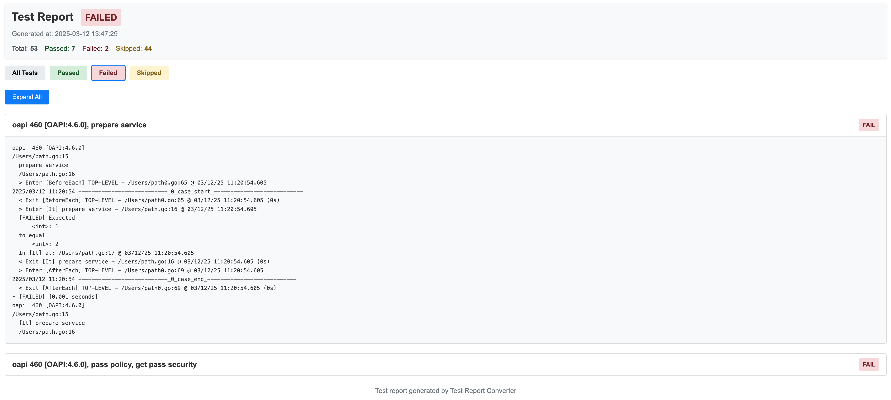

# Test Report Converter

A simple Go tool to convert test report logs into readable HTML reports.

## Features

- Parses test report logs and generates a clean, interactive HTML report
- Shows test status (pass, fail, skip) with color coding
- Provides a summary of test results
- Allows expanding/collapsing test details

## Sample



## Usage

```bash
# run test
go test --ginkgo.vv --ginkgo.no-color...

# Specify custom input and output files
go run test_report_converter.go -input=/path/to/your/test_report.log -output=/path/to/output/report.html
```

## Report Format

The HTML report includes:

1. A header with generation timestamp
2. A summary section showing total, passed, failed, and skipped tests
3. An expandable list of test cases with:
    - Test title
    - Test status (pass, fail, skip)
    - Detailed log content (expandable)
4. Expand/collapse all button for easy navigation

## How It Works

The converter parses the test report log according to these rules:

1. Test cases are separated by `------------------------------`
2. Test status is determined by keywords:
    - `[SKIPPED]` indicates a skipped test
    - `[FAILED]` indicates a failed test
    - Otherwise, the test is considered passed
3. Test titles are extracted from lines before the `> Enter` marker
4. All content from each test case is preserved in the report

## Requirements

- Go 1.13 or higher 